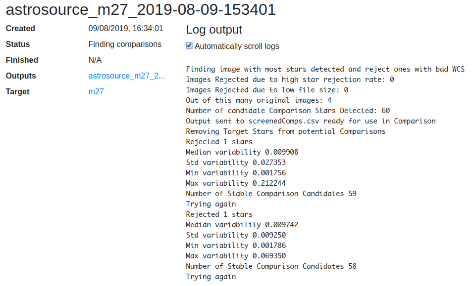

# Data Pipelines

In this project, a *pipeline* refers to a process that takes a `Target` and a
list of `DataProduct` objects as inputs, performs some process on the data
(which are usually FITS files), and produces some outputs. A *process* refers
to an instance of a pipeline for a particular target and set of input files.

Processes are run by selecting a number of data products on the target data
page in `tom_education`, and selecting the pipeline to run. Processes run
asynchronously, and a [separate page shown the status and log output as it
progresses](#status-and-log-page).

On completion, outputs from a process are saved in the TOM as either
`DataProduct` or `ReducedDatum` objects. See the section below on [saving
outputs](#saving-outputs) for more details.

## Defining a pipeline

Pipelines are defined by creating a sub-class of
`tom_education.models.PipelineProcess` somewhere within your project, and
referencing them from `settings.py`, e.g:

```python
...
TOM_EDUCATION_PIPELINES = {
    # name: pipeline class. The name will be shown in the UI
    'My pipeline': 'my_project.pipelines.MyPipeline'
}
...
```

The following class serves as a minimal example showing the methods that must
be defined.

```python
from tom_dataproducts.models import DataProduct, ReducedDatum
from tom_education.models import PipelineProcess, PipelineOutput

class ExamplePipelineProcess(PipelineProcess):
    # Label used as a prefix for names of generated data products
    short_name = 'example'

    # Optional list of suffixes for input files. The process will fail if
    # trying to run with files that do not end in one of these suffixes.
    allowed_suffixes = ['.fits', '.fz']

    # Make this a proxy: we do not want this to be a concrete model (which
    # would use a separate DB table and require migrations)
    class Meta:
        proxy = True
        # app label is required if this class is defined outside of an app
        # listed in INSTALLED_APPS
        app_label = 'myapp'

    def do_pipeline(self, tmpdir):
        """
        This method does the actual work.

        `tmpdir` is `pathlib.Path` object for a temporary directory which can
        be used to write outputs and other temporary files.

        This method will return a sequence of PipelineOutput objects (or
        tuples) for the output files that should be saved in the TOM.
        """
        # The `Target` object is available as `self.target`
        ra = self.target.ra
        dec = self.target.dec

        # The input files are available as `self.input_files`. This is a Django
        # `ManyRelatedManager` object of `DataProduct` objects: use
        # `self.input_files.all()` to get the inputs as a list.
        for product in self.input_files.all():
            path = product.data.path
            # Do something with file...

        # Create some output files
        outcsv = tmpdir / 'my_output.csv'
        outcsv.write_text('data here')
        outpng = tmpdir / 'anther_output.png'
        outpng.write_bytes(b'PNG data here')

        return [
            PipelineOutput(path=outcsv, output_type=ReducedDatum),
            (outpng, DataProduct)  # Can output a tuple instead of PipelineOutput
        ]
```

# Saving Outputs

Outputs are saved in the TOM as either `DataProduct` or `ReducedDatum`; the
definition of these models can be found in the [tom_dataproducts source
code](https://github.com/TOMToolkit/tom_base/blob/master/tom_dataproducts/models.py).

`DataProduct` objects have a file field which can store arbitrary files. This
can be used for binary files such as FITS files and other images.

A `ReducedDatum` object represents a single piece of 'reduced' data, and stores
the value as a free-form text field. This can be used for text outputs such as
CSV, and plain text files.

To specify which output type should be used for each file, the `do_pipeline()`
method of a `PipelineProcess` class should return a list of `PipelineOutput`
objects (or tuples from which a `PipelineOutput` can be instantiated).
`PipelineOutput` is a
[namedtuple](https://docs.python.org/3/library/collections.html#collections.namedtuple)
class with the following fields

* `path`: A `pathlib.Path` object for the file to save
* `output_type`: Either `DataProduct` or `ReducedDatum`
* `tag`: (Optional) A string value to use for the `tag` field for `DataProduct`
  objects or `data_type` field for `ReducedDatum`.

If at least one `DataProduct` output is produced, a new `DataProductGroup` is
created to hold these products.

## Errors

To stop a process and mark it as a failure, raise a `tom_education.models.AsyncError` exception:

```python
from tom_education.models import AsyncError
...

class MyPipeline(PipelineProcess):
    ...
    def do_pipeline(self, tmpdir):
        raise AsyncError('Something went terribly wrong')
```

This will set the `status` field of the process to
`tom_education.models.ASYNC_STATUS_FAILED`, and the given error message will be
shown in the UI.

## Status updates

For long-running pipelines, or ones with several steps, it may be useful to set
the status of a process as it progresses. For this, a `PipelineProcess` has a
`status` field which can be set to any string value. The `PipelineProcess` must
be saved after the status is changed with `self.save()`. This status will be
shown and updated in the UI on the page for the process.

To prevent repetition in the code when updating the status, performing some
task and saving, a context manager `self.update_status` is available:

```python
def do_pipeline(self, tmpdir):
    with self.update_status('Doing the first thing'):
        # do something
        ...

    with self.update_status('Done that - now doing the second thing')
        # do something else
        ...
    ...
```

On successful completion of the process (that is, if `do_pipeline()` finishes
without raising a `AsyncError`), the status is set to
`tom_education.models.ASYNC_STATUS_CREATED`.

## Log output

More granular updates can be given by logging messages with `self.log()`:

```python
def do_pipeline(self, tmpdir):
    with self.update_status('Doing something important'):
        self.log('first sub-step')
        self.log('second sub-step')
        ...
    ...
```

Log output is also shown in the UI on the page for a process.

## Flags

Pipelines may be parametrised by a number of boolean parameters ('*flags*'),
whose values are selected by the user when the process is scheduled and passed
as keyword arguments to the `do_pipeline()` method. To define flags, set the
`flags` attribute on the pipeline class:

```python
class FlagDemo(PipelineProcess):
    # `flags` is a dictionary that maps flag names to their default values and
    # long descriptions
    flags = {
        'some_flag': {'default': True, 'long_name': 'Long name to be displayed in the UI'},
        'another_flag': {'default': False, 'long_name': 'Another flag'}
    }
    ...

    def do_pipeline(self, tmpdir, **flags):
        some_flag = flags.pop('some_flag')
        another_flag = flags.pop('another_flag')
        ...
    ...
```

Note that flag names should not contain whitespace.

## Status and log page

The status and log output of a pipeline process can be viewed at
`/pipeline/<PK>`. Log output is updated every second, and can be scrolled
automatically. This page also provides links to the data product group
containing outputs.


