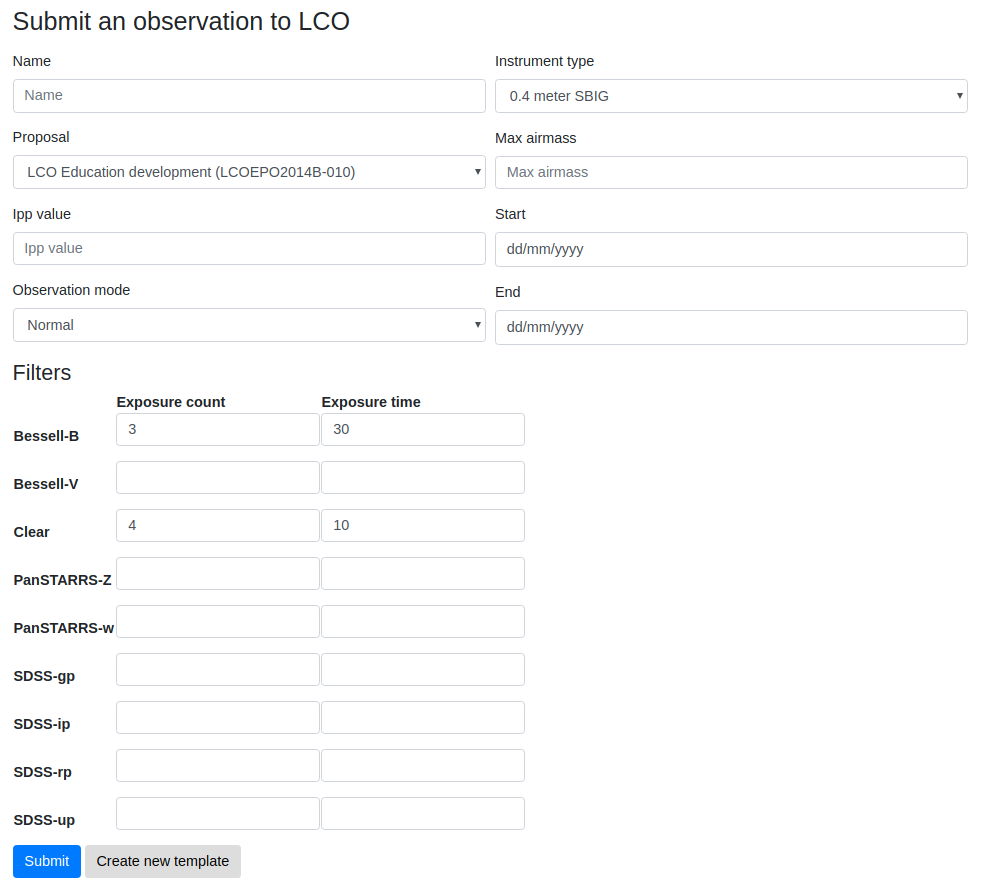

# Observations with multiple instrument configurations

The LCO observation form allows multiple filters to be selected for a single
observation. Each filter can have its own exposure count and exposure time
settings. In the screenshot below, `Bessell-B` is selected for three 30 second
exposures, and `Clear` is selected for four 10 second exposures.

Note that not all filters need to be applied: the exposure count and exposure
time inputs can be left blank for unwanted filters. However, at least one
filter must be used.
