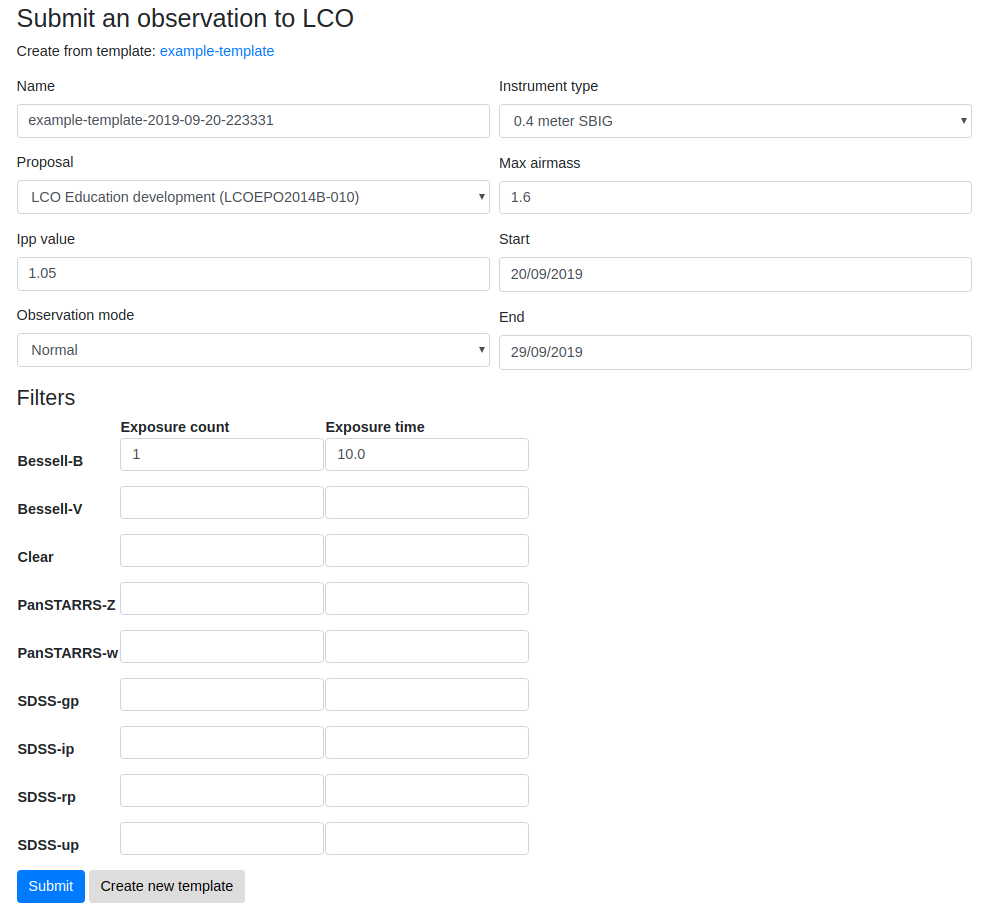

# Templated observation forms

When creating a new observation, the form fields can be saved as a template.
Future observations can then be created from the template with all fields
identical except for 'group ID', which has the date appended to it.

Currently templates cannot be edited through the interface once created. For
this, use the Django admin and edit the `fields` field.

